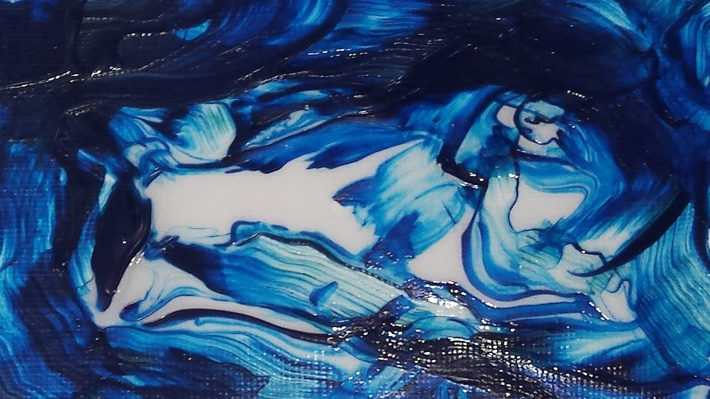

# Neural-Style-Transfer
## Pytorch implementation of Neural Style Transfer Algorithm 
### link to the paper: https://arxiv.org/abs/1508.06576
### content image

### style image

### Image transformation from noise to the output

### How to run

    1. First install the required package using the command:
        
        pip3 install -r 'requirements.txt'
    2. Add your style image in the root directory as 'style.jpg'
    3. Add your content image in the root directory as 'content.jpg'
    4. Run this command to generate final output:
        
        python3 nst.py

    5. A gif will be generated named 'output.gif'

### Note: The production version of this project is under development which can be found in backend/ directory
